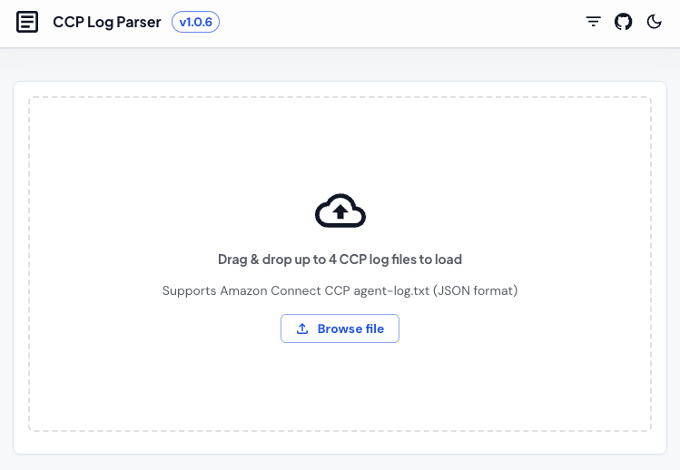
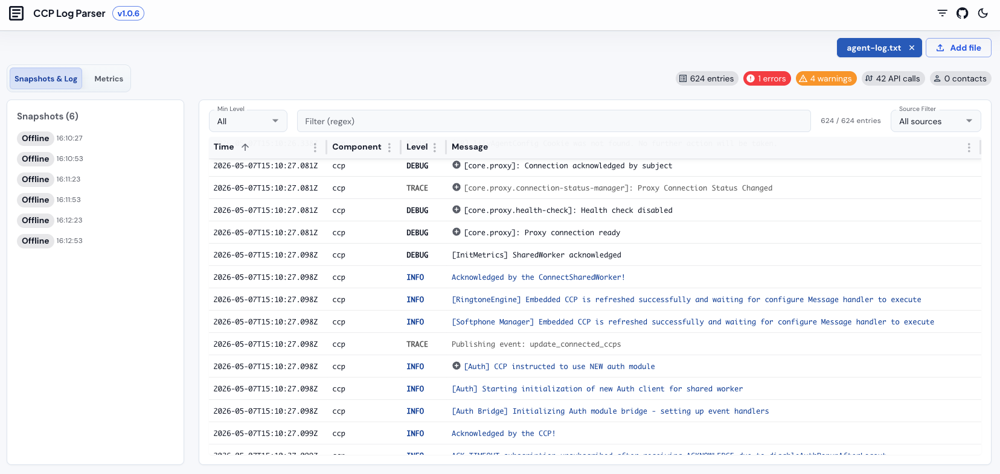
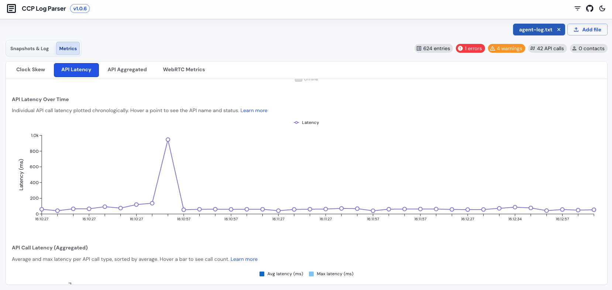

# CCP Log Parser

A standalone React SPA for parsing and debugging Amazon Connect CCP (Contact Control Panel) log files. Drag and drop log files, apply custom filters, and quickly identify errors, warnings, and key events across contact sessions.

## Table of Contents

- [Screenshots](#screenshots)
- [Features](#features)
- [Prerequisites](#prerequisites)
- [Installation](#installation)
- [Commands](#commands)
- [Tech Stack](#tech-stack)
- [Project Structure](#project-structure)
- [Deployment](#deployment)
- [Contributing](#contributing)

## Screenshots

### Drop zone

Drag and drop one or more CCP log files, or use the file picker.



### Log table

Sortable, filterable log entries with snapshot navigation, contact filtering, and inline exception details.



### Metrics charts

Clock skew, API latency, and WebRTC softphone metrics with interactive tooltips and time-range zoom.



## Features

- **Drag & drop file loading** — drop one or more CCP log files onto the page, or use the file picker
- **Log table** — sortable, filterable, virtualised table powered by Material React Table
- **Custom source filters** — create, edit, and delete filters with custom label/prefix pairs; persisted to localStorage
- **Contact filter** — filter log entries by contact ID
- **Metrics charts** — clock skew over time, API latency (time-series and aggregated), and WebRTC softphone metrics (audio levels, packets, jitter buffer, round-trip time) with interactive tooltips and warning indicators
- **WebRTC time-range zoom** — slider to zoom into a portion of a softphone call; shared across input/output stream tabs
- **Snapshot navigation** — click API snapshots to jump directly to the corresponding log entry
- **Inline exception summaries** — exception details shown inline without expanding the row
- **Dark / light mode** — toggle between themes; preference persisted automatically
- **Built-in usage guide** — comprehensive documentation accessible from the app header ([view guide](https://colinmorris83.github.io/ccp-log-parser/#/guide))

## Prerequisites

- Node.js 22+
- npm 10+

## Installation

1. Clone this repository.
2. Run `npm install` to install dependencies.

## Commands

| Task                 | Command                 |
| -------------------- | ----------------------- |
| Start dev server     | `npm run start`         |
| Build for production | `npm run build`         |
| Run all tests        | `npm test`              |
| Run tests (watch)    | `npm run test:watch`    |
| Lint (all)           | `npm run lint`          |
| Lint fix (ESLint)    | `npm run lint:fix`      |
| Format check         | `npm run lint:prettier` |
| Format fix           | `npm run prettier:fix`  |

The dev server starts on <http://localhost:3100>.

`npm run build` runs a TypeScript typecheck (`tsc -b`) before bundling — fix any type errors before building.

## Tech Stack

| Layer             | Technology                       |
| ----------------- | -------------------------------- |
| UI framework      | React 19, TypeScript 6           |
| Build tool        | Vite 8                           |
| Component library | MUI 9, Material React Table 3    |
| Charts            | MUI X Charts 9                   |
| Routing           | TanStack Router 1                |
| Testing           | Vitest 4, React Testing Library  |
| Formatting        | Prettier 3                       |
| Linting           | ESLint 10                        |
| Git hooks         | Husky 9, commitlint, lint-staged |

## Project Structure

```text
src/
  components/         -- UI components
    AppHeader/        -- Top bar with title, version, theme toggle, guide link
    CcpLogParser/     -- Main page: orchestrates log table, metrics, snapshots
    DropZone/         -- Drag-and-drop file upload area
    FileUploadButton/ -- File picker button
    FilterManager/    -- CRUD dialog for custom source filters
    Guide/            -- Built-in usage guide and documentation page
    LogTable/         -- Virtualised log table with filtering and row expansion
    MetricsPanel/     -- Charts: clock skew, API latency, WebRTC softphone metrics
    MrtThemeProvider/ -- Material React Table theme wrapper
    SegmentedTabs/    -- Tab switcher for multi-file views
    SnapshotList/     -- Clickable API snapshot navigation list
  constants/          -- Shared constant values
  contexts/           -- React context providers (FilterContext)
  hooks/              -- Custom React hooks (useCustomFilters, useMrtTheme)
  models/             -- TypeScript interfaces and types
  theme/              -- MUI theme configuration (light + dark)
  utils/              -- Pure utility functions (log parser, localStorage)
```

## Contributing

- **Commit messages**: [Conventional Commits](https://www.conventionalcommits.org/) enforced by commitlint (`feat:`, `fix:`, `chore:`, `refactor:`, `test:`, `docs:`, etc.)
- **Pre-commit hook**: runs `lint-staged` — ESLint and Prettier checks on staged files
- **Tests**: co-located alongside source files using the `.spec.ts` / `.spec.tsx` suffix

## Deployment

The app is deployed to GitHub Pages automatically via GitHub Actions on every push to `main`.

- **Live URL**: <https://colinmorris83.github.io/ccp-log-parser/>
- **Workflow**: `.github/workflows/deploy.yml`
- **Pipeline**: Install → Lint → Test → Build → Deploy

To enable deployment on a new repo, go to **Settings → Pages → Source** and select **GitHub Actions**.
